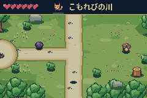
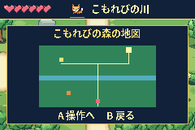
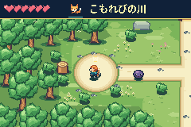
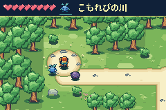
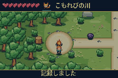
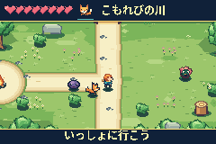

# Scrolling exploration milestone — verification

Verified 2026-10-05 against actual merged main `120a1062f9849cdf0b642989318ca36ec2309b92`.

- ROM: **571,408 bytes**
- SHA-256: `a0c68c5ecde39b75b7bbafff4e19467d1e6cc901bb1c99b92af60492d3de375c`
- Clean GCC 14.2.1 build, valid GBA header/checksum, no `-Wall -Wextra` warnings
- Source and asset regeneration deterministic, retaining the published small-include packaging

## Gameplay and persistence

113 checks pass: 20 full-journey assertions, 19 independent edge assertions and 74 exploration assertions. Tests execute the real `.gba` using mGBA 0.10.5 with its HLE BIOS, controller input and read-only symbol inspection. They do not inject normal gameplay progress into RAM.

Coverage includes:

- Complete existing chapter without the optional health upgrade
- Both camera axes, all clamp boundaries, physical entrance/return paths, fixed HUD and journal map
- River gating, companion power, adjacent blocked banks and collision-safe dodge
- Camp healing, safe checkpoint offset, ordinary travel versus retry/continue semantics
- One-time chest, permanent eight-heart maximum, death/retry and SRAM reopening
- Three-strike combo, locked ranged aim and exactly 30 update warnings before a shot
- Authentic format-2 bridge and completed saves created by playing the published ROM, migrated and reopened as format 3
- Explicit corrupt/checksummed-invalid fixture rejection, fresh-game reset and ending persistence

The optional-route video also uses only controls: camp, map, bridge, relic, ranged encounter, temple, guardian and chapter ending. It records native emulator frames at real GBA cadence with actual emulator audio.

## Frame pacing and exact pixels

All 19 cadence scenes pass. The four new moving-camera stress windows combine following companions, sword attacks, toast UI, ranged warning/projectiles, diagonal motion and dodge. They produce **1,440/1,440 updates and presentations**, with no missed hot frames.

Worst sampled scrolling update/render work: **125,325 cycles (44.6%)** of the 280,896-cycle display-frame budget, before the small OAM commit. The display cadence is ~59.7275 Hz, not the host's emulation speed. Original menu cold-build tests retain their bounded two-frame transition target.

For every camera-x modulo-4 alignment, **28,560 displayed VRAM background pixels** match the original atlas exactly, with zero mismatches. This specifically guards the aligned even/odd DMA viewport path.

## Reproduce

```sh
make
./tools/build_mgba_bridge.sh
make test
make test-tools
make assets
make
```

Optional footage: `python3 tests/capture_milestone_video.py` (ffmpeg required). Detailed generated traces and save fixtures live under ignored `build/`; concise committed evidence is in [milestone1/summary.json](milestone1/summary.json), [exploration-results.json](milestone1/exploration-results.json) and [performance results](perf/final.json).

## Screens








## Limits

Physical GBA hardware, flash cartridges, other emulators, compiler versions and the macOS native bridge build remain untested. These are representative reproducible emulator tests, not an exhaustive worst-case timing proof. The game remains the first chapter; the completion roadmap's later dungeon/companion arcs and final campaign ending are not yet implemented. No remote CI is configured in this repository.
