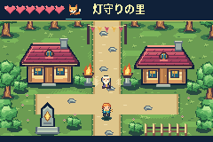
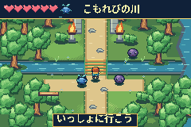
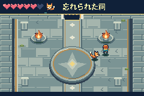
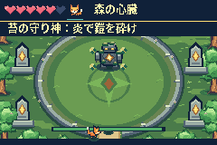
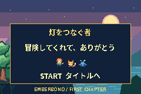

# Verification — visual and motion polish, 2026-10-05

ROM: `91da6f939d18037a0f4c164d9c2c4b0b9f41782e6f2f4a9b253212b5fec0dddf` (SHA-256), 254,576 bytes. Native ARM7TDMI header/checksum valid. Build succeeds with `-Wall -Wextra` and no warnings. No gameplay RAM injection is used by the normal tests.

## Actual-emulator gameplay

The native mGBA 0.10.5 core executes the final `.gba` ROM with HLE BIOS. The tests use GBA button inputs and read-only inspection of symbols from the matching ELF.

- 20 primary assertions pass from title through Japanese dialogue, summoning, nature bridge, temple braziers, guardian fire/sword fight and ending
- 19 independent assertions pass for natural death/retry, input blocking while dead, cooldowns, SRAM reopened in a new emulator, ending/fresh-game persistence, armor immunity and exposed-core damage
- Corrupted save rejection intentionally modifies a copy of an SRAM file, not emulator RAM
- Original-ROM SRAM compatibility verified with a real controller-created checkpoint from the first playable build
- Recorded full playthrough: 2,447 hardware frames, approximately 41 seconds; native frames captured at ~59.7275 Hz with actual GBA audio
- Split-screen motion comparison: 15 seconds at real GBA cadence using independently controller-reached original/revised states; no interpolated frames

## Frame pacing

The strict [performance suite](perf/README.md) passes all 15 steady scenes: each has 360 updates and 360 presentations across 360 emulated hardware frames. Representative boss windows include eight simultaneous projectiles. No measured hot frame missed presentation.

Cold intro/pause entry recognizes input within one hardware frame and has at most a two-frame update interval while rasterizing uncached UI. The largest measured gameplay update+render workload is 206,060 cycles (73.4% of a 280,896-cycle frame, before OAM commit). Diagonal normalization and equal-axis heading pass. Two complete performance captures produced identical results.

The three-update sword hit-stop is intentional combat feedback and does not stop rendering. Scope is representative repeated windows, not an exhaustive worst-case proof.

## Reproduce

```sh
make
./tools/build_mgba_bridge.sh
make test
make gameplay-video  # optional; needs ffmpeg
```

`make test` runs primary gameplay, independent edge cases and strict performance tests. The primary test creates the completed SRAM used by the independent tests. Generated outputs stay under ignored `build/`.

Machine-readable gameplay results: [verification-results.json](verification-results.json). Exact performance provenance: [perf/final.json](perf/final.json).

## Visual checks







## Limits

Physical GBA hardware, flash cartridges, alternative emulators and alternate compiler releases have not been tested. This remains a short first chapter: four compact fixed-screen areas, two companions and one boss, with original pixel art. It does not claim the breadth or commercial-level polish of its reference game.

## Source packaging

Generated C pixel data is stored as line-aligned include chunks for review and upload. The generator reproduces that layout. A clean build from these sources produces the identical ROM hash shown above; gameplay and strict performance tests were rerun. The performance JSON is compacted without changing its parsed values.
